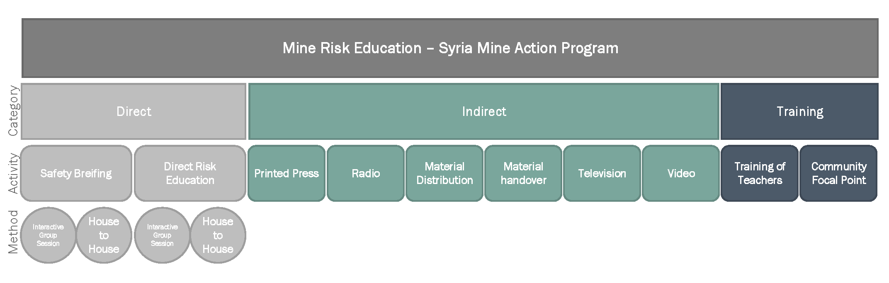

*******************
Risk Education Form
*******************

.. contents:: Table of Contents

This is the main form used to collect data regarding the Risk Education Activity in Syria.

Form Version
------------
Data field to reference the version of the form. Forms are ongoing modification and updating and require a mechanism to follow up on development. This is not a mandatory field and will be used mainly for of the form tracking. 

+------------------------+-------------------------------------------------------------------------------------+
| Field Name             | form_version                                                                        |
+------------------------+-------------------------------------------------------------------------------------+
| Type                   | Text                                                                                |
+------------------------+-------------------------------------------------------------------------------------+
| Default Value          | v0.01_data                                                                          |
+------------------------+-------------------------------------------------------------------------------------+
| Suggested Text         | Report ID                                                                           |
+------------------------+-------------------------------------------------------------------------------------+
| Arabic Label           | رقم التقرير                                                                         |
+------------------------+-------------------------------------------------------------------------------------+

General Information
-------------------
This group of data fields will provide the basic identification of each report submitted. It will use for searching, and quality management purposes. Also it will assist in the coordination process among partners. 

Form ID 
^^^^^^^

This is the main report ID, each field report must be assigned a special report identification that is unique and can help distinguish reports by organizations. This will be assigned by UNMAS to each report received.

+------------------------+-------------------------------------------------------------------------------------+
| Field Name             | id_re_sy                                                                            |
+------------------------+-------------------------------------------------------------------------------------+
| Type                   | Text                                                                                |
+------------------------+-------------------------------------------------------------------------------------+
| Calculation            | ``${organsiation ID} + '-RE-' + format-date(${start_date},'%Y%m%d-%H%M')``          |
+------------------------+-------------------------------------------------------------------------------------+
| Mandatory              | **Yes**                                                                             |
+------------------------+-------------------------------------------------------------------------------------+
| Unique                 | **Yes**                                                                             |
+------------------------+-------------------------------------------------------------------------------------+
| Suggested Text         | Report ID                                                                           |
+------------------------+-------------------------------------------------------------------------------------+
| Arabic Label           | رقم التقرير                                                                         |
+------------------------+-------------------------------------------------------------------------------------+

Report Date
^^^^^^^^^^^
The date the report was submitted. It is different from the activity date. 

+------------------------+-------------------------------------------------------------------------------------+
| Field Name             | report_date                                                                         |
+------------------------+-------------------------------------------------------------------------------------+
| Type                   | Date                                                                                |
+------------------------+-------------------------------------------------------------------------------------+
| Mandatory              | **Yes**                                                                             |
+------------------------+-------------------------------------------------------------------------------------+
| Unique                 | **Yes**                                                                             |
+------------------------+-------------------------------------------------------------------------------------+
| Default Value          | ``now()``                                                                           |
+------------------------+-------------------------------------------------------------------------------------+
| Suggested Text         | ``Date of report``                                                                  |
+------------------------+-------------------------------------------------------------------------------------+
| Arabic Label           | ``تاريخ التقرير``                                                                   |
+------------------------+-------------------------------------------------------------------------------------+

Organisation Report ID
^^^^^^^^^^^^^^^^^^^^^^
The name of the organization conducting the risk education. Each partners will be assigned a unique identification number for security. Please consult with UNMAS for to be added to the system.

+------------------------+-------------------------------------------------------------------------------------+
| Field Name             | org_code                                                                            |
+------------------------+-------------------------------------------------------------------------------------+
| Type                   | Select_one                                                                          |
+------------------------+-------------------------------------------------------------------------------------+
| Selection              | Will be provided for each organization                                              |
+------------------------+-------------------------------------------------------------------------------------+
| Mandatory              | **Yes**                                                                             |
+------------------------+-------------------------------------------------------------------------------------+
| Unique                 |                                                                                     |
+------------------------+-------------------------------------------------------------------------------------+
| Suggested Text         | Organisation                                                                        |
+------------------------+-------------------------------------------------------------------------------------+
| Arabic Label           |  المنظمة                                                                            |
+------------------------+-------------------------------------------------------------------------------------+

Region 
^^^^^^
The region that this report is coming from, in Syria there are 4 regions. This field will assist in reporting of activities as per each region.

+------------------------+-------------------------------------------------------------------------------------+
| Field Name             | op_region                                                                           |
+------------------------+-------------------------------------------------------------------------------------+
| Type                   | Select_one                                                                          |
+------------------------+-------------------------------------------------------------------------------------+
| Selection              |- ``ne_syria``: North East Syria                                                     |
|                        |- ``nw_syria``: North West Syria                                                     |
|                        |- ``south_syria``: South Syria                                                       |
|                        |- ``damascus``: Damascus                                                             |
+------------------------+-------------------------------------------------------------------------------------+
| Mandatory              |                                                                                     |
+------------------------+-------------------------------------------------------------------------------------+
| Unique                 |                                                                                     |
+------------------------+-------------------------------------------------------------------------------------+
| Suggested Text         |  Select Area of operations                                                          |
+------------------------+-------------------------------------------------------------------------------------+
| Arabic Label           |                                                                                     |
+------------------------+-------------------------------------------------------------------------------------+

Team Identification
^^^^^^^^^^^^^^^^^^^
The team that collected the information by the Organization, this will be used in QM processing. Please refer back to UNMAS for the assigning a unique identification for your teams.

+------------------------+-------------------------------------------------------------------------------------+
| Field Name             | team                                                                                |
+------------------------+-------------------------------------------------------------------------------------+
| Type                   | Select_one                                                                          |
+------------------------+-------------------------------------------------------------------------------------+
| Selection              | Will be provided for each organization                                              |
+------------------------+-------------------------------------------------------------------------------------+
| Mandatory              | **Yes**                                                                             |
+------------------------+-------------------------------------------------------------------------------------+
| Unique                 |                                                                                     |
+------------------------+-------------------------------------------------------------------------------------+
| Suggested Text         | Team                                                                                |
+------------------------+-------------------------------------------------------------------------------------+
| Arabic Label           | الفريق                                                                              |
+------------------------+-------------------------------------------------------------------------------------+

Location Information
--------------------
to link the activity to a location, depending on the gazetteer published by the UNOCHA for Syria. Contact UNMAS to know which version is being used. 

Administrative Level 1
^^^^^^^^^^^^^^^^^^^^^^
The governorate *P-Code* in which the operations was conducted. The list will be build on the OCHA Gazetteer. Please check with UNMAS for the latest gazetteer used in system.

+------------------------+-------------------------------------------------------------------------------------+
| Field Name             | admin1                                                                              |
+------------------------+-------------------------------------------------------------------------------------+
| Type                   | Select_one                                                                          |
+------------------------+-------------------------------------------------------------------------------------+
| Selection              | The list of Governorate from the Syrian Gazetteer                                   |
+------------------------+-------------------------------------------------------------------------------------+
| Mandatory              | **Yes**                                                                             |
+------------------------+-------------------------------------------------------------------------------------+
| Unique                 | **Yes**                                                                             |
+------------------------+-------------------------------------------------------------------------------------+
| Suggested Text         |  Governorate                                                                        |
+------------------------+-------------------------------------------------------------------------------------+
| Arabic Label           | المحافظة                                                                            |
+------------------------+-------------------------------------------------------------------------------------+

Administrative Level 1 Name
^^^^^^^^^^^^^^^^^^^^^^^^^^^
This will contain the governorate/admin1 name in English and will be used in the database

+------------------------+-------------------------------------------------------------------------------------+
| Field Name             | admin1_name                                                                         |
+------------------------+-------------------------------------------------------------------------------------+
| Type                   | Text                                                                                |
+------------------------+-------------------------------------------------------------------------------------+
| Mandatory              |                                                                                     |
+------------------------+-------------------------------------------------------------------------------------+
| Unique                 |                                                                                     |
+------------------------+-------------------------------------------------------------------------------------+
| Hidden                 | **Yes**                                                                             |
+------------------------+-------------------------------------------------------------------------------------+
| Suggested Text         |  Governorate (en)                                                                   |
+------------------------+-------------------------------------------------------------------------------------+
| Arabic Label           |                                                                                     |
+------------------------+-------------------------------------------------------------------------------------+

Administrative Level 2
^^^^^^^^^^^^^^^^^^^^^^
The district/admin2 *P-Code* in which the operations was conducted. The list will be build on the OCHA Gazetteer. Please check with UNMAS for the latest gazetteer used in system

+------------------------+-------------------------------------------------------------------------------------+
| Field Name             | admin2                                                                              |
+------------------------+-------------------------------------------------------------------------------------+
| Type                   | Select_one                                                                          |
+------------------------+-------------------------------------------------------------------------------------+
| Selection              |The list of districts from the Syrian Gazetteer                                      |
+------------------------+-------------------------------------------------------------------------------------+
| Mandatory              | **Yes**                                                                             |
+------------------------+-------------------------------------------------------------------------------------+
| Unique                 | **Yes**                                                                             |
+------------------------+-------------------------------------------------------------------------------------+
| Suggested Text         |District                                                                             |
+------------------------+-------------------------------------------------------------------------------------+
| Arabic Label           | المنطقة                                                                             |
+------------------------+-------------------------------------------------------------------------------------+

Administrative Level 2 Name
^^^^^^^^^^^^^^^^^^^^^^^^^^^
This will contain the district/admin2 name in English and will be used in the database.

+------------------------+-------------------------------------------------------------------------------------+
| Field Name             | admin2_name                                                                         |
+------------------------+-------------------------------------------------------------------------------------+
| Type                   | Text                                                                                |
+------------------------+-------------------------------------------------------------------------------------+
| Mandatory              |                                                                                     |
+------------------------+-------------------------------------------------------------------------------------+
| Unique                 |                                                                                     |
+------------------------+-------------------------------------------------------------------------------------+
| Hidden                 | **Yes**                                                                             |
+------------------------+-------------------------------------------------------------------------------------+
| Suggested Text         |   District (en)                                                                     |
+------------------------+-------------------------------------------------------------------------------------+
| Arabic Label           |                                                                                     |
+------------------------+-------------------------------------------------------------------------------------+

Administrative Level 3
^^^^^^^^^^^^^^^^^^^^^^
The sub-district/admin3 *P-Code* in which the operations was conducted. The list will be build on the OCHA Gazetteer. Please check with UNMAS for the latest gazetteer used in system

+------------------------+-------------------------------------------------------------------------------------+
| Field Name             | admin3                                                                              |
+------------------------+-------------------------------------------------------------------------------------+
| Type                   | Select_one                                                                          |
+------------------------+-------------------------------------------------------------------------------------+
| Selection              |The list of sub-districts from the Syrian Gazetteer                                  |
+------------------------+-------------------------------------------------------------------------------------+
| Mandatory              | **Yes**                                                                             |
+------------------------+-------------------------------------------------------------------------------------+
| Unique                 | **Yes**                                                                             |
+------------------------+-------------------------------------------------------------------------------------+
| Suggested Text         |  Sub-District                                                                       |
+------------------------+-------------------------------------------------------------------------------------+
| Arabic Label           |  الناحية                                                                            |
+------------------------+-------------------------------------------------------------------------------------+

Administrative Level 3 Name
^^^^^^^^^^^^^^^^^^^^^^^^^^^
This will contain the sub-district/admin3 English name and will be used in the database

+------------------------+-------------------------------------------------------------------------------------+
| Field Name             | admin3_name                                                                         |
+------------------------+-------------------------------------------------------------------------------------+
| Type                   | Text                                                                                |
+------------------------+-------------------------------------------------------------------------------------+
| Mandatory              |                                                                                     |
+------------------------+-------------------------------------------------------------------------------------+
| Unique                 |                                                                                     |
+------------------------+-------------------------------------------------------------------------------------+
| Hidden                 | **Yes**                                                                             |
+------------------------+-------------------------------------------------------------------------------------+
| Suggested Text         |   Sub-District (en)                                                                 |
+------------------------+-------------------------------------------------------------------------------------+
| Arabic Label           |                                                                                     |
+------------------------+-------------------------------------------------------------------------------------+

Administrative Level 4
^^^^^^^^^^^^^^^^^^^^^^
The community/admin4 or the nearest community to the location *P-Code* in which the operations was conducted. The list will be build on the OCHA Gazetteer. Please check with UNMAS for the latest gazetteer used in system

+------------------------+-------------------------------------------------------------------------------------+
| Field Name             | admin4                                                                              |
+------------------------+-------------------------------------------------------------------------------------+
| Type                   | Select_one                                                                          |
+------------------------+-------------------------------------------------------------------------------------+
| Selection              |The list of communities from the Syrian Gazetteer                                    |
+------------------------+-------------------------------------------------------------------------------------+
| Mandatory              | **Yes**                                                                             |
+------------------------+-------------------------------------------------------------------------------------+
| Unique                 | **Yes**                                                                             |
+------------------------+-------------------------------------------------------------------------------------+
| Suggested Text         |   Community                                                                         |
+------------------------+-------------------------------------------------------------------------------------+
| Arabic Label           |  قرية/مدينة                                                                         |
+------------------------+-------------------------------------------------------------------------------------+

Administrative Level 4 Name
^^^^^^^^^^^^^^^^^^^^^^^^^^^
This will contain the community/admin4 English name and will be used in the database.

+------------------------+-------------------------------------------------------------------------------------+
| Field Name             | admin4_name                                                                         |
+------------------------+-------------------------------------------------------------------------------------+
| Type                   | Text                                                                                |
+------------------------+-------------------------------------------------------------------------------------+
| Mandatory              |                                                                                     |
+------------------------+-------------------------------------------------------------------------------------+
| Unique                 |                                                                                     |
+------------------------+-------------------------------------------------------------------------------------+
| Hidden                 | **Yes**                                                                             |
+------------------------+-------------------------------------------------------------------------------------+
| Suggested Text         |   Community (en)                                                                    |
+------------------------+-------------------------------------------------------------------------------------+
| Arabic Label           |                                                                                     |
+------------------------+-------------------------------------------------------------------------------------+

Neighborhood Name
^^^^^^^^^^^^^^^^^
In case of large urban communities, it is highly recommend to enter the neighborhood name. It is advice to have it written in English as it was agreed among all stakeholders.

+------------------------+-------------------------------------------------------------------------------------+
| Field Name             | neighborhood                                                                        |
+------------------------+-------------------------------------------------------------------------------------+
| Type                   | Text                                                                                |
+------------------------+-------------------------------------------------------------------------------------+
| Mandatory              |                                                                                     |
+------------------------+-------------------------------------------------------------------------------------+
| Unique                 |                                                                                     |
+------------------------+-------------------------------------------------------------------------------------+
| Hidden                 | **Yes**                                                                             |
+------------------------+-------------------------------------------------------------------------------------+
| Suggested Text         | Neighborhood                                                                        |
+------------------------+-------------------------------------------------------------------------------------+
| Arabic Label           |  الحي                                                                               |
+------------------------+-------------------------------------------------------------------------------------+

Safety to Acquire GPS 
^^^^^^^^^^^^^^^^^^^^^
Is it safe to collect geopoint information from the group, and with their consent, this will be used mainly in case of areas that could put the enumerators in harms way by collecting the geo information.

+------------------------+-------------------------------------------------------------------------------------+
| Field Name             | geo_safe                                                                            |
+------------------------+-------------------------------------------------------------------------------------+
| Type                   | Select_one                                                                          |
+------------------------+-------------------------------------------------------------------------------------+
| Selection              |- ``yes``: Yes                                                                       |
|                        |- ''no'' : No                                                                        |
+------------------------+-------------------------------------------------------------------------------------+
| Mandatory              | **Yes**                                                                             |
+------------------------+-------------------------------------------------------------------------------------+
| Unique                 |                                                                                     |
+------------------------+-------------------------------------------------------------------------------------+
| Suggested Text         | Is it safe to record a geo location for this RE Activity                            |
+------------------------+-------------------------------------------------------------------------------------+
| Arabic Label           |                                                                                     |
+------------------------+-------------------------------------------------------------------------------------+

Community Center Coordinates
^^^^^^^^^^^^^^^^^^^^^^^^^^^^
The lat/long location of the risk education session. Captured using a GPS device of the mobile devices.

+------------------------+-------------------------------------------------------------------------------------+
| Field Name             | community_coordinates                                                               |
+------------------------+-------------------------------------------------------------------------------------+
| Type                   | GeoPoint                                                                            |
+------------------------+-------------------------------------------------------------------------------------+
| Mandatory              |                                                                                     |
+------------------------+-------------------------------------------------------------------------------------+
| Unique                 |                                                                                     |
+------------------------+-------------------------------------------------------------------------------------+
| Suggested Text         |   Capture the location of the RE Activity                                           |
+------------------------+-------------------------------------------------------------------------------------+
| Arabic Label           |                                                                                     |
+------------------------+-------------------------------------------------------------------------------------+

Latitude
^^^^^^^^
For the database usage, this field will be calculated between the GPS point and the gazetteer locations provided.

+------------------------+-------------------------------------------------------------------------------------+
| Field Name             | re_latitude                                                                         |
+------------------------+-------------------------------------------------------------------------------------+
| Type                   | decimal / Calculated                                                                |
+------------------------+-------------------------------------------------------------------------------------+
| Mandatory              |                                                                                     |
+------------------------+-------------------------------------------------------------------------------------+
| Unique                 |                                                                                     |
+------------------------+-------------------------------------------------------------------------------------+
| Suggested Text         |   Latitude                                                                          |
+------------------------+-------------------------------------------------------------------------------------+
| Arabic Label           |                                                                                     |
+------------------------+-------------------------------------------------------------------------------------+

Longitude
^^^^^^^^^
For the database usage, this field will be calculated between the GPS point and the gazetteer locations provided

+------------------------+-------------------------------------------------------------------------------------+
| Field Name             | re_longitude                                                                        |
+------------------------+-------------------------------------------------------------------------------------+
| Type                   | decimal / Calculated                                                                |
+------------------------+-------------------------------------------------------------------------------------+
| Mandatory              |                                                                                     |
+------------------------+-------------------------------------------------------------------------------------+
| Unique                 |                                                                                     |
+------------------------+-------------------------------------------------------------------------------------+
| Suggested Text         |  Longitude                                                                          |
+------------------------+-------------------------------------------------------------------------------------+
| Arabic Label           |                                                                                     |
+------------------------+-------------------------------------------------------------------------------------+

GPS Accuracy
^^^^^^^^^^^^
For the database usage, this field will be calculated between the GPS point and the gazetteer locations provided

+------------------------+-------------------------------------------------------------------------------------+
| Field Name             | re_gps_accuracy                                                                     |
+------------------------+-------------------------------------------------------------------------------------+
| Type                   | decimal / Calculated                                                                |
+------------------------+-------------------------------------------------------------------------------------+
| Mandatory              |                                                                                     |
+------------------------+-------------------------------------------------------------------------------------+
| Unique                 |                                                                                     |
+------------------------+-------------------------------------------------------------------------------------+
| Suggested Text         |   GPS Accuracy (in meters)                                                          |
+------------------------+-------------------------------------------------------------------------------------+
| Arabic Label           |  دقة نظام تحديد المواقع (بوحدة المتر)                                               |
+------------------------+-------------------------------------------------------------------------------------+

IDP Camp
^^^^^^^^
This question will verify if that location is an IDP camp or not.

+------------------------+-------------------------------------------------------------------------------------+
| Field Name             | idp_camp                                                                            |
+------------------------+-------------------------------------------------------------------------------------+
| Type                   | Select_one                                                                          |
+------------------------+-------------------------------------------------------------------------------------+
| Selection              |- ``yes``: Yes                                                                       |
|                        |- ''no'' : No                                                                        |
+------------------------+-------------------------------------------------------------------------------------+
| Mandatory              | **Yes**                                                                             |
+------------------------+-------------------------------------------------------------------------------------+
| Unique                 |                                                                                     |
+------------------------+-------------------------------------------------------------------------------------+
| Suggested Text         |   Is the location an IDP camp?                                                      |
+------------------------+-------------------------------------------------------------------------------------+
| Arabic Label           |   هل يعد هذا الموقع مخيم للنازحين؟                                                  |
+------------------------+-------------------------------------------------------------------------------------+

IDP Camp Name
^^^^^^^^^^^^^
In case if this location is an IDP camp then please provide the name of the IDP camp.

+------------------------+-------------------------------------------------------------------------------------+
| Field Name             | idp_camp_name                                                                       |
+------------------------+-------------------------------------------------------------------------------------+
| Type                   | Text                                                                                |
+------------------------+-------------------------------------------------------------------------------------+
| Mandatory              |                                                                                     |
+------------------------+-------------------------------------------------------------------------------------+
| Unique                 |                                                                                     |
+------------------------+-------------------------------------------------------------------------------------+
| Suggested Text         | Name of the camp                                                                    |
+------------------------+-------------------------------------------------------------------------------------+
| Arabic Label           | إن وجد, أدخل رمز المنطقة او اسم المخيم                                              |
+------------------------+-------------------------------------------------------------------------------------+

Risk Education Details
----------------------
Risk Education compose of different activities that targets the people in need. For data collection porpoises the Syria program adopt a structure for classification and categorizing risk education activities conducted in Syria. As depicted in the diagram below.  

All activities in Syria are categories under three main groups : 
	- Direct
	- Indirect
	- Training

Each group composed of different activities as organized by color. 

re_category
^^^^^^^^^^^
What is the category of this group, a list is provided please make sure that you use one of the items listed in the "Options" Sheet under "re_category"

+------------------------+-------------------------------------------------------------------------------------+
| Type                   | Select_one                                                                          |
+------------------------+-------------------------------------------------------------------------------------+
| Selection              |- ``direct``: Direct                                                                 |
|                        |- ``indirect``: Indirect                                                             |
|                        |- ``training``: Training                                                             |
+------------------------+-------------------------------------------------------------------------------------+
| Mandatory              | **Yes**                                                                             |
+------------------------+-------------------------------------------------------------------------------------+
| Unique                 |                                                                                     |
+------------------------+-------------------------------------------------------------------------------------+
| Suggested Text         |Risk Education Category                                                              |
+------------------------+-------------------------------------------------------------------------------------+
| Arabic Label           |حدد نوع التوعية                                                                      |
+------------------------+-------------------------------------------------------------------------------------+

re_activity
^^^^^^^^^^^
Depending on the category selected these activities will be listed below.   

+------------------------+-------------------------------------------------------------------------------------+
| Type                   | Select_one                                                                          |
+------------------------+-------------------------------------------------------------------------------------+
| Selection              |- Category = **Direct**                                                              |
|                        |    - ``safety_briefing``: Safety Briefing                                           |
|                        |    - ``directre``: Direct Risk Education                                            |
|                        |- Category = **Indirect**                                                            |
|                        |    - ``materialdistribution``: Material Distribution                                |
|                        |    - ``materialhandover``: Material handover                                        |
|                        |    - ``radio``: Radio                                                               |
|                        |    - ``tv``: Television                                                             |
|                        |    - ``video``: Video                                                               |
|                        |    - ``socialmedia``: Social Media                                                  |
|                        |    - ``printedpress``: Printed press (newspapers, magazines)                        |
|                        |- Category = **Training**                                                            |
|                        |    - ``tot``: Training of Teachers (ToT)                                            |
|                        |    - ``cfp``: Community Focal Point (CFP)                                           |
+------------------------+-------------------------------------------------------------------------------------+
| Dependency             | **Yes**                                                                             |
+------------------------+-------------------------------------------------------------------------------------+
| Depend on Data Field   | re_category                                                                         |
+------------------------+-------------------------------------------------------------------------------------+
| Mandatory              | **Yes**                                                                             |
+------------------------+-------------------------------------------------------------------------------------+
| Unique                 |                                                                                     |
+------------------------+-------------------------------------------------------------------------------------+
| Suggested Text         | Type of Activity                                                                    |
+------------------------+-------------------------------------------------------------------------------------+
| Arabic Label           | حدد نوع النشاط                                                                      |
+------------------------+-------------------------------------------------------------------------------------+

re_activity_other
^^^^^^^^^^^^^^^^^
In case the Risk Education Activity selected was -Other- then we will require to understand what type of activity was conducted. 

+------------------------+-------------------------------------------------------------------------------------+
| Type                   | Text                                                                                |
+------------------------+-------------------------------------------------------------------------------------+
| Mandatory              |                                                                                     |
+------------------------+-------------------------------------------------------------------------------------+
| Unique                 |                                                                                     |
+------------------------+-------------------------------------------------------------------------------------+
| Suggested Text         | Please describe the other activity                                                  |
+------------------------+-------------------------------------------------------------------------------------+
| Arabic Label           | اشرح نوع النشاط الاخر                                                               |
+------------------------+-------------------------------------------------------------------------------------+

re_method
^^^^^^^^^
In case the Risk Education category is direct you will need to identify which method was used based on the selection below 

+------------------------+-------------------------------------------------------------------------------------+
| Type                   | Select_one                                                                          |
+------------------------+-------------------------------------------------------------------------------------+
| Selection              |- ``interactive_group_session``: Interactive group session                           |
|                        |- ``house_to_house``: House to house                                                 |
|                        |- ``focus_group_discussion``: Focus group discussionTraining                         |
|                        |- ``peer_to_peer``: Peer-to-peer                                                     |
|                        |- ``theatre``: Training                                                              |
|                        |- ``other``: Other                                                                   |
+------------------------+-------------------------------------------------------------------------------------+
| Mandatory              | **Yes**                                                                             |
+------------------------+-------------------------------------------------------------------------------------+
| Unique                 |                                                                                     |
+------------------------+-------------------------------------------------------------------------------------+
| Suggested Text         |What method was used to deliver the activity?                                        |
+------------------------+-------------------------------------------------------------------------------------+
| Arabic Label           | ما االطريقة المستخدمة لإيصال جلسة التوعية؟                                          |
+------------------------+-------------------------------------------------------------------------------------+

re_sessions_no
^^^^^^^^^^^^^^
The number of session conducted and reported in a single report, minimum value is 1. 

+------------------------+-------------------------------------------------------------------------------------+
| Type                   | Number                                                                              |
+------------------------+-------------------------------------------------------------------------------------+
| Mandatory              |                                                                                     |
+------------------------+-------------------------------------------------------------------------------------+
| Unique                 |                                                                                     |
+------------------------+-------------------------------------------------------------------------------------+
| Suggested Text         | Number of Sessions conducted                                                        |
+------------------------+-------------------------------------------------------------------------------------+
| Arabic Label           | عدد جلسات التوعية التي تمت                                                          |
+------------------------+-------------------------------------------------------------------------------------+

location_type
^^^^^^^^^^^^^
The location in which the activity has been conducted. 

+------------------------+-------------------------------------------------------------------------------------+
| Type                   | Select_one                                                                          |
+------------------------+-------------------------------------------------------------------------------------+
| Selection              |- ``camp``: Camp                                                                     |
|                        |- ``child_friendly_space``: Child-friendly                                           |
|                        |- ``community_centre``: Community center                                             |
|                        |- ``education_facility``: Education facility                                         |
|                        |- ``farm``: Farm                                                                     |
|                        |- ``household``: Household                                                           |
|                        |- ``market``: Market                                                                 |
|                        |- ``medical_facility``: Medical facility                                             |
|                        |- ``religious_site``: Religious site                                                 |
|                        |- ``Other``: Other                                                                   |
+------------------------+-------------------------------------------------------------------------------------+
| Mandatory              |                                                                                     |
+------------------------+-------------------------------------------------------------------------------------+
| Unique                 |                                                                                     |
+------------------------+-------------------------------------------------------------------------------------+
| Suggested Text         |Where was the session conducted?                                                     |
+------------------------+-------------------------------------------------------------------------------------+
| Arabic Label           |اين اقيمت الجلسه؟                                                                    |
+------------------------+-------------------------------------------------------------------------------------+

session_date
^^^^^^^^^^^^
The date that the risk education session took place. This is the actual date of the session and it could be different form the report date.

+------------------------+-------------------------------------------------------------------------------------+
| Type                   | Date                                                                                |
+------------------------+-------------------------------------------------------------------------------------+
| Mandatory              | **Yes**                                                                             |
+------------------------+-------------------------------------------------------------------------------------+
| Unique                 | **Yes**                                                                             |
+------------------------+-------------------------------------------------------------------------------------+
| Suggested Text         |   The session Date                                                                  |
+------------------------+-------------------------------------------------------------------------------------+
| Arabic Label           | تاريخ الجلسة                                                                        |
+------------------------+-------------------------------------------------------------------------------------+

start_time
^^^^^^^^^^
The time that the risk education session started. This is the actual time that the session started.

+------------------------+-------------------------------------------------------------------------------------+
| Type                   | Time                                                                                |
+------------------------+-------------------------------------------------------------------------------------+
| Mandatory              |                                                                                     |
+------------------------+-------------------------------------------------------------------------------------+
| Unique                 |                                                                                     |
+------------------------+-------------------------------------------------------------------------------------+
| Suggested Text         | Start Date                                                                          |
+------------------------+-------------------------------------------------------------------------------------+
| Arabic Label           | وقت البدء                                                                           |
+------------------------+-------------------------------------------------------------------------------------+

end_time
^^^^^^^^
The time that the risk education session ended. This is the actual time that the session ended.

+------------------------+-------------------------------------------------------------------------------------+
| Type                   | Time                                                                                |
+------------------------+-------------------------------------------------------------------------------------+
| Mandatory              |                                                                                     |
+------------------------+-------------------------------------------------------------------------------------+
| Unique                 |                                                                                     |
+------------------------+-------------------------------------------------------------------------------------+
| Suggested Text         | End Date                                                                            |
+------------------------+-------------------------------------------------------------------------------------+
| Arabic Label           | وقت النهاية                                                                         |
+------------------------+-------------------------------------------------------------------------------------+

broadcast_start_date
^^^^^^^^^^^^^^^^^^^^
When the operator conduct a campaign using either TV, radio, Social media or News Paper, this is the data that this campaign started. 

+------------------------+-------------------------------------------------------------------------------------+
| Type                   | Date                                                                                |
+------------------------+-------------------------------------------------------------------------------------+
| Mandatory              | **Yes**                                                                             |
+------------------------+-------------------------------------------------------------------------------------+
| Unique                 | **Yes**                                                                             |
+------------------------+-------------------------------------------------------------------------------------+
| Suggested Text         |  Broadcast start date                                                               |
+------------------------+-------------------------------------------------------------------------------------+
| Arabic Label           | تاريخ بدء النشر                                                                     |
+------------------------+-------------------------------------------------------------------------------------+

broadcast_end_date
^^^^^^^^^^^^^^^^^^
When the operator conduct a campaign using either TV, radio, Social media or News Paper, this is the data that this campaign ended. 

+------------------------+-------------------------------------------------------------------------------------+
| Type                   | Date                                                                                |
+------------------------+-------------------------------------------------------------------------------------+
| Mandatory              | **Yes**                                                                             |
+------------------------+-------------------------------------------------------------------------------------+
| Unique                 | **Yes**                                                                             |
+------------------------+-------------------------------------------------------------------------------------+
| Suggested Text         |  Broadcast end date                                                                 |
+------------------------+-------------------------------------------------------------------------------------+
| Arabic Label           | تاريخ بدء النشر                                                                     |
+------------------------+-------------------------------------------------------------------------------------+

other_activities
^^^^^^^^^^^^^^^^
The aim of this data field is to gather if there is any other activities has been conducted during the risk education and are relative to the mine action. 

+------------------------+-------------------------------------------------------------------------------------+
| Type                   | Select_one                                                                          |
+------------------------+-------------------------------------------------------------------------------------+
| Selection              |- ``yes``: Yes                                                                       |
|                        |- ''no'' : No                                                                        |
+------------------------+-------------------------------------------------------------------------------------+
| Mandatory              | **Yes**                                                                             |
+------------------------+-------------------------------------------------------------------------------------+
| Unique                 |                                                                                     |
+------------------------+-------------------------------------------------------------------------------------+
| Suggested Text         | Were there other activities conducted along side the RE ?                           |
+------------------------+-------------------------------------------------------------------------------------+
| Arabic Label           |  هل هناك نشاطات اخرى اقيمت مع هذه الجلسة حول التوعيه بالمخاطر؟                      |
+------------------------+-------------------------------------------------------------------------------------+

other_activities_type
^^^^^^^^^^^^^^^^^^^^^
In the case of there was other activities conducted, please selected one or more of the following. 

+------------------------+-------------------------------------------------------------------------------------+
| Type                   | Select_one                                                                          |
+------------------------+-------------------------------------------------------------------------------------+
| Selection              |- ``agriculture``: Agriculture                                                       |
|                        |- ``casualty_data_collection``: Casualty data collection                             |
|                        |- ``child_protection``: Child protection                                             |
|                        |- ``explosive_hazard_removal``: Explosive hazard removal                             |
|                        |- ``hazard_data_collection``: Hazard data collection                                 |
|                        |- ``healthcare``: Healthcare                                                         |
|                        |- ``infrastructure_rehabilitation``: Infrastructure rehabilitation                   |
|                        |- ``marking_of_hazards``: Marking of hazards                                         |
|                        |- ``refugee_idp_resettlement``: Refugee/IDP resettlement                             |
|                        |- ``Other``: Other                                                                   |
+------------------------+-------------------------------------------------------------------------------------+
| Mandatory              |                                                                                     |
+------------------------+-------------------------------------------------------------------------------------+
| Unique                 |                                                                                     |
+------------------------+-------------------------------------------------------------------------------------+
| Suggested Text         |If yes, what other type of activities were conducted?                                |
+------------------------+-------------------------------------------------------------------------------------+
| Arabic Label           |اذا كان نعم, ما هو نوع النشاطات التي اقيمت ؟                                         |
+------------------------+-------------------------------------------------------------------------------------+

Beneficiaries Details
----------------------
This is the part of the Risk Education form we aim to collect information about the beneficiaries, classified by the gender and Age. this in compliance with gender and diversity data requirement, - Sex & Age Disaggregated Date [SADD] methodology.

It is important to notice the age classification differ from one organization to the another. For the Syria Risk Education we are using simplified classification to collect information about the beneficialness and affected population whom received some from of risk education.

+---------+-----------------+
|  Age    |      Gender     |
+---------+-----------------+
+ 6 - 12  +   Male / Female |   
+---------+-----------------+
+ 13 - 17 +   Male / Female |
+---------+-----------------+
+   +18   +   Male / Female |
+---------+-----------------+

audience
^^^^^^^^
The primary audience who have received the risk education activity aim of this data field is to gather if there is any other activities has been conducted during the risk education and are relative to the mine action. 

+------------------------+-------------------------------------------------------------------------------------+
| Type                   | Select_one                                                                          |
+------------------------+-------------------------------------------------------------------------------------+
| Selection              |- ``community_points``: Community focal points                                       |
|                        |- ``community_leaders``: Community leaders                                           |
|                        |- ``convoy_drivers``: Convoy drivers                                                 |
|                        |- ``farmers``: Farmers                                                               |
|                        |- ``health_workers``: Health workers                                                 |
|                        |- ``reconstruction_workers``: Reconstruction workers                                 |
|                        |- ``refugees_IDPs``: Refugees/IDPs                                                   |
|                        |- ``religious_leaders``: Religious leaders                                           |
|                        |- ``scrap_dealers``: Scrap metal collectors/dealers                                  |
|                        |- ``teachers``: Teachers                                                             |
|                        |- ``Other``: Other                                                                   |
+------------------------+-------------------------------------------------------------------------------------+
| Mandatory              | **Yes**                                                                             |
+------------------------+-------------------------------------------------------------------------------------+
| Unique                 |                                                                                     |
+------------------------+-------------------------------------------------------------------------------------+
| Suggested Text         | Who was the primary audience? (choose one)                                          |
+------------------------+-------------------------------------------------------------------------------------+
| Arabic Label           | من هو المشارك الاساسي؟ /اختر واحدة                                                  |
+------------------------+-------------------------------------------------------------------------------------+

male_5_12
^^^^^^^^^
The number of **male** beneficiaries who attended the activity and between the age of 5 years and 12 years, minimum value is 0. 

+------------------------+-------------------------------------------------------------------------------------+
| Type                   | Number                                                                              |
+------------------------+-------------------------------------------------------------------------------------+
| Mandatory              |                                                                                     |
+------------------------+-------------------------------------------------------------------------------------+
| Unique                 |                                                                                     |
+------------------------+-------------------------------------------------------------------------------------+
| Suggested Text         | Male 5-12 years old                                                                 |
+------------------------+-------------------------------------------------------------------------------------+
| Arabic Label           | ذكر 5-12 سنه                                                                        |
+------------------------+-------------------------------------------------------------------------------------+

female_5_12
^^^^^^^^^^^
The number of **female** beneficiaries who attended the activity and between the age of 5 years and 12 years, minimum value is 0. 

+------------------------+-------------------------------------------------------------------------------------+
| Type                   | Number                                                                              |
+------------------------+-------------------------------------------------------------------------------------+
| Mandatory              |                                                                                     |
+------------------------+-------------------------------------------------------------------------------------+
| Unique                 |                                                                                     |
+------------------------+-------------------------------------------------------------------------------------+
| Suggested Text         | Female 5-12 years old                                                               |
+------------------------+-------------------------------------------------------------------------------------+
| Arabic Label           | انثى 5-12 سنه                                                                       |
+------------------------+-------------------------------------------------------------------------------------+

male_13_17
^^^^^^^^^^
The number of **male** beneficiaries who attended the activity and between the age of 13 years and 17 years, minimum value is 0. 

+------------------------+-------------------------------------------------------------------------------------+
| Type                   | Number                                                                              |
+------------------------+-------------------------------------------------------------------------------------+
| Mandatory              |                                                                                     |
+------------------------+-------------------------------------------------------------------------------------+
| Unique                 |                                                                                     |
+------------------------+-------------------------------------------------------------------------------------+
| Suggested Text         | Male 13-17 years old                                                                |
+------------------------+-------------------------------------------------------------------------------------+
| Arabic Label           | ذكر 13-17 سنه                                                                       |
+------------------------+-------------------------------------------------------------------------------------+

female_13_17
^^^^^^^^^^^^
The number of **female** beneficiaries who attended the activity and between the age of 13 years and 17 years, minimum value is 0. 

+------------------------+-------------------------------------------------------------------------------------+
| Type                   | Number                                                                              |
+------------------------+-------------------------------------------------------------------------------------+
| Mandatory              |                                                                                     |
+------------------------+-------------------------------------------------------------------------------------+
| Unique                 |                                                                                     |
+------------------------+-------------------------------------------------------------------------------------+
| Suggested Text         | Female 13-17 years old                                                              |
+------------------------+-------------------------------------------------------------------------------------+
| Arabic Label           | انثى 13-17 سنه                                                                      |
+------------------------+-------------------------------------------------------------------------------------+

male_18_plus
^^^^^^^^^^^^
The number of **male** beneficiaries who attended the activity and are 18 years of age or older, minimum value is 0. 

+------------------------+-------------------------------------------------------------------------------------+
| Type                   | Number                                                                              |
+------------------------+-------------------------------------------------------------------------------------+
| Mandatory              |                                                                                     |
+------------------------+-------------------------------------------------------------------------------------+
| Unique                 |                                                                                     |
+------------------------+-------------------------------------------------------------------------------------+
| Suggested Text         | Male 18+ years old                                                                  |
+------------------------+-------------------------------------------------------------------------------------+
| Arabic Label           | ذكر فوق 18 سنه                                                                      |
+------------------------+-------------------------------------------------------------------------------------+

female_18_plus
^^^^^^^^^^^^^^
The number of **female** beneficiaries who attended the activity and are 18 years of age or older, minimum value is 0. 

+------------------------+-------------------------------------------------------------------------------------+
| Type                   | Number                                                                              |
+------------------------+-------------------------------------------------------------------------------------+
| Mandatory              |                                                                                     |
+------------------------+-------------------------------------------------------------------------------------+
| Unique                 |                                                                                     |
+------------------------+-------------------------------------------------------------------------------------+
| Suggested Text         | Female 18+ years old                                                                |
+------------------------+-------------------------------------------------------------------------------------+
| Arabic Label           | انثى فوق 18 سنه                                                                     |
+------------------------+-------------------------------------------------------------------------------------+

total_audience
^^^^^^^^^^^^^^
The total number of beneficiaries who attended the activity. This number should match the disaggregated data of all age and gender. 

+------------------------+-------------------------------------------------------------------------------------+
| Type                   | Number                                                                              |
+------------------------+-------------------------------------------------------------------------------------+
| Mandatory              |                                                                                     |
+------------------------+-------------------------------------------------------------------------------------+
| Unique                 |                                                                                     |
+------------------------+-------------------------------------------------------------------------------------+
| Suggested Text         | Total Audience                                                                      |
+------------------------+-------------------------------------------------------------------------------------+
| Arabic Label           | مجموع الحاضرين                                                                      |
+------------------------+-------------------------------------------------------------------------------------+

first_time_beneficiaries
^^^^^^^^^^^^^^^^^^^^^^^^
The total number of beneficiaries who attended risk education activity for the first time. This number should not be more than the ``total_audience``. 

+------------------------+-------------------------------------------------------------------------------------+
| Type                   | Number                                                                              |
+------------------------+-------------------------------------------------------------------------------------+
| Mandatory              |                                                                                     |
+------------------------+-------------------------------------------------------------------------------------+
| Unique                 |                                                                                     |
+------------------------+-------------------------------------------------------------------------------------+
| Suggested Text         | How many of the total people reached were first-time beneficiaries?                 |
+------------------------+-------------------------------------------------------------------------------------+
| Arabic Label           | كم عدد الاشخاص المستفيدين للمره الاولى من العدد الكلي الذي تم الوصول اليه           |
+------------------------+-------------------------------------------------------------------------------------+

Materials Distributed
---------------------
Listing any material was distributed during the risk education activity to the beneficiaries. Here are listed some of the material that distributed in Syria, however and in case if the material does not exist, please fill the other material distributed fields.

posters
^^^^^^^
The aim of this data field is to verify if any posters were distributed during the risk education.

+------------------------+-------------------------------------------------------------------------------------+
| Type                   | Select_one                                                                          |
+------------------------+-------------------------------------------------------------------------------------+
| Selection              |- ``yes``: Yes                                                                       |
|                        |- ''no'' : No                                                                        |
+------------------------+-------------------------------------------------------------------------------------+
| Mandatory              | **Yes**                                                                             |
+------------------------+-------------------------------------------------------------------------------------+
| Unique                 |                                                                                     |
+------------------------+-------------------------------------------------------------------------------------+
| Suggested Text         | Posters                                                                             |
+------------------------+-------------------------------------------------------------------------------------+
| Arabic Label           |  ملصقات                                                                             |
+------------------------+-------------------------------------------------------------------------------------+

posters_qty
^^^^^^^^^^^
The number of posters beneficiaries received during the activity. 

+------------------------+-------------------------------------------------------------------------------------+
| Type                   | Number                                                                              |
+------------------------+-------------------------------------------------------------------------------------+
| Mandatory              |                                                                                     |
+------------------------+-------------------------------------------------------------------------------------+
| Unique                 |                                                                                     |
+------------------------+-------------------------------------------------------------------------------------+
| Suggested Text         | Posters Qty                                                                         |
+------------------------+-------------------------------------------------------------------------------------+
| Arabic Label           | عدد الملصقات                                                                        |
+------------------------+-------------------------------------------------------------------------------------+

brochures
^^^^^^^^^
The aim of this data field is to verify if any brochures were distributed during the risk education.

+------------------------+-------------------------------------------------------------------------------------+
| Type                   | Select_one                                                                          |
+------------------------+-------------------------------------------------------------------------------------+
| Selection              |- ``yes``: Yes                                                                       |
|                        |- ''no'' : No                                                                        |
+------------------------+-------------------------------------------------------------------------------------+
| Mandatory              | **Yes**                                                                             |
+------------------------+-------------------------------------------------------------------------------------+
| Unique                 |                                                                                     |
+------------------------+-------------------------------------------------------------------------------------+
| Suggested Text         | Brochures                                                                           |
+------------------------+-------------------------------------------------------------------------------------+
| Arabic Label           |  كتيبات                                                                             |
+------------------------+-------------------------------------------------------------------------------------+

brochures_qty
^^^^^^^^^^^^^
The number of brochures beneficiaries received during the activity. 

+------------------------+-------------------------------------------------------------------------------------+
| Type                   | Number                                                                              |
+------------------------+-------------------------------------------------------------------------------------+
| Mandatory              |                                                                                     |
+------------------------+-------------------------------------------------------------------------------------+
| Unique                 |                                                                                     |
+------------------------+-------------------------------------------------------------------------------------+
| Suggested Text         | Brochures Qty                                                                       |
+------------------------+-------------------------------------------------------------------------------------+
| Arabic Label           | عدد الكتيبات                                                                        |
+------------------------+-------------------------------------------------------------------------------------+

t_shirts
^^^^^^^^
The aim of this data field is to verify if any T-Shirts were distributed during the risk education.

+------------------------+-------------------------------------------------------------------------------------+
| Type                   | Select_one                                                                          |
+------------------------+-------------------------------------------------------------------------------------+
| Selection              |- ``yes``: Yes                                                                       |
|                        |- ''no'' : No                                                                        |
+------------------------+-------------------------------------------------------------------------------------+
| Mandatory              | **Yes**                                                                             |
+------------------------+-------------------------------------------------------------------------------------+
| Unique                 |                                                                                     |
+------------------------+-------------------------------------------------------------------------------------+
| Suggested Text         | T Shirts                                                                            |
+------------------------+-------------------------------------------------------------------------------------+
| Arabic Label           |  القمصان                                                                            |
+------------------------+-------------------------------------------------------------------------------------+

t_shirts_qty
^^^^^^^^^^^^
The number of T-Shirts beneficiaries received during the activity. 

+------------------------+-------------------------------------------------------------------------------------+
| Type                   | Number                                                                              |
+------------------------+-------------------------------------------------------------------------------------+
| Mandatory              |                                                                                     |
+------------------------+-------------------------------------------------------------------------------------+
| Unique                 |                                                                                     |
+------------------------+-------------------------------------------------------------------------------------+
| Suggested Text         | T Shirts Qty                                                                        |
+------------------------+-------------------------------------------------------------------------------------+
| Arabic Label           | عدد القمصان                                                                         |
+------------------------+-------------------------------------------------------------------------------------+

bags
^^^^
The aim of this data field is to verify if any bags were distributed during the risk education.

+------------------------+-------------------------------------------------------------------------------------+
| Type                   | Select_one                                                                          |
+------------------------+-------------------------------------------------------------------------------------+
| Selection              |- ``yes``: Yes                                                                       |
|                        |- ''no'' : No                                                                        |
+------------------------+-------------------------------------------------------------------------------------+
| Mandatory              | **Yes**                                                                             |
+------------------------+-------------------------------------------------------------------------------------+
| Unique                 |                                                                                     |
+------------------------+-------------------------------------------------------------------------------------+
| Suggested Text         | Were there other activities conducted along side the RE ?                           |
+------------------------+-------------------------------------------------------------------------------------+
| Arabic Label           |  هل هناك نشاطات اخرى اقيمت مع هذه الجلسة حول التوعيه بالمخاطر؟                      |
+------------------------+-------------------------------------------------------------------------------------+

bags_qty
^^^^^^^^
The number of Bags beneficiaries received during the activity. 

+------------------------+-------------------------------------------------------------------------------------+
| Type                   | Number                                                                              |
+------------------------+-------------------------------------------------------------------------------------+
| Mandatory              |                                                                                     |
+------------------------+-------------------------------------------------------------------------------------+
| Unique                 |                                                                                     |
+------------------------+-------------------------------------------------------------------------------------+
| Suggested Text         | Female 18+ years old                                                                |
+------------------------+-------------------------------------------------------------------------------------+
| Arabic Label           | انثى فوق 18 سنه                                                                     |
+------------------------+-------------------------------------------------------------------------------------+

other_material
^^^^^^^^^^^^^^
Was any other material distributed to the beneficiaries during the activity. 

+------------------------+-------------------------------------------------------------------------------------+
| Type                   | Select_one                                                                          |
+------------------------+-------------------------------------------------------------------------------------+
| Selection              |- ``yes``: Yes                                                                       |
|                        |- ''no'' : No                                                                        |
+------------------------+-------------------------------------------------------------------------------------+
| Mandatory              | **Yes**                                                                             |
+------------------------+-------------------------------------------------------------------------------------+
| Unique                 |                                                                                     |
+------------------------+-------------------------------------------------------------------------------------+
| Suggested Text         | Other Material                                                                      |
+------------------------+-------------------------------------------------------------------------------------+
| Arabic Label           |  مواد اخرى                                                                          |
+------------------------+-------------------------------------------------------------------------------------+

other_material_specify
^^^^^^^^^^^^^^^^^^^^^^
This is to specify what type of material distrusted, in case different items just list them all here.

+------------------------+-------------------------------------------------------------------------------------+
| Type                   | Text                                                                                |
+------------------------+-------------------------------------------------------------------------------------+
| Mandatory              |                                                                                     |
+------------------------+-------------------------------------------------------------------------------------+
| Unique                 |                                                                                     |
+------------------------+-------------------------------------------------------------------------------------+
| Suggested Text         | Other Material Specify                                                              |
+------------------------+-------------------------------------------------------------------------------------+
| Arabic Label           | مواد اخرى / حدد                                                                     |
+------------------------+-------------------------------------------------------------------------------------+

other_material_qty
^^^^^^^^^^^^^^^^^^
The total number of all other material beneficiaries received during the activity.

+------------------------+-------------------------------------------------------------------------------------+
| Type                   | Number                                                                              |
+------------------------+-------------------------------------------------------------------------------------+
| Mandatory              |                                                                                     |
+------------------------+-------------------------------------------------------------------------------------+
| Unique                 |                                                                                     |
+------------------------+-------------------------------------------------------------------------------------+
| Suggested Text         | Other Material Qty                                                                  |
+------------------------+-------------------------------------------------------------------------------------+
| Arabic Label           | عدد المواد الاخرى ==                                                                |
+------------------------+-------------------------------------------------------------------------------------+

Form Follow up and verification
-------------------------------

Contact Points Details

contact1_name
^^^^^^^^^^^^^
The first contact points name of the community focal point who assist in conducting the activity

+------------------------+-------------------------------------------------------------------------------------+
| Type                   | Text                                                                                |
+------------------------+-------------------------------------------------------------------------------------+
| Mandatory              | **Yes**                                                                             |
+------------------------+-------------------------------------------------------------------------------------+
| Unique                 |                                                                                     |
+------------------------+-------------------------------------------------------------------------------------+
| Suggested Text         | Name of community focal point (1FemName of community focal point(1)                 |
+------------------------+-------------------------------------------------------------------------------------+
| Arabic Label           | اسم المنسق الاول                                                                    |
+------------------------+-------------------------------------------------------------------------------------+

contact1_phone
^^^^^^^^^^^^^^
The first contact phone of the community focal point who assist in conducting the activity

+------------------------+-------------------------------------------------------------------------------------+
| Type                   | Text                                                                                |
+------------------------+-------------------------------------------------------------------------------------+
| Mandatory              | **Yes**                                                                             |
+------------------------+-------------------------------------------------------------------------------------+
| Unique                 |                                                                                     |
+------------------------+-------------------------------------------------------------------------------------+
| Suggested Text         | Tel. number of community focal point (1)                                            |
+------------------------+-------------------------------------------------------------------------------------+
| Arabic Label           | رقم هاتف المنسق الاول                                                               |
+------------------------+-------------------------------------------------------------------------------------+

contact2_name
^^^^^^^^^^^^^^
The second contact name of the community focal point who assist in conducting the activity

+------------------------+-------------------------------------------------------------------------------------+
| Type                   | Text                                                                                |
+------------------------+-------------------------------------------------------------------------------------+
| Mandatory              |                                                                                     |
+------------------------+-------------------------------------------------------------------------------------+
| Unique                 |                                                                                     |
+------------------------+-------------------------------------------------------------------------------------+
| Suggested Text         | Name of community focal point (2)                                                   |
+------------------------+-------------------------------------------------------------------------------------+
| Arabic Label           | اسم المنسق الثاني                                                                   |
+------------------------+-------------------------------------------------------------------------------------+

contact2_phone
^^^^^^^^^^^^^^
The second contact phone of the community focal point who assist in conducting the activity

+------------------------+-------------------------------------------------------------------------------------+
| Type                   | Text                                                                                |
+------------------------+-------------------------------------------------------------------------------------+
| Mandatory              |                                                                                     |
+------------------------+-------------------------------------------------------------------------------------+
| Unique                 |                                                                                     |
+------------------------+-------------------------------------------------------------------------------------+
| Suggested Text         | Name of community focal point (2)                                                   |
+------------------------+-------------------------------------------------------------------------------------+
| Arabic Label           | رقم هاتف المنسق الثاني                                                              |
+------------------------+-------------------------------------------------------------------------------------+

